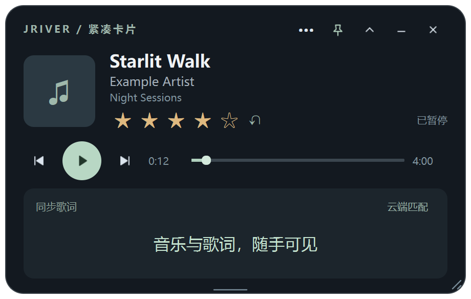

# JRiver Floating Card

让 JRiver 以小窗常驻桌面：置顶、鼠标穿透、快捷键切换、播放控制和同步歌词。
适合工作或游戏时查看歌曲和歌词，穿透模式下鼠标直接操作后面的窗口。
音频始终由 JRiver 输出；本项目没有音频解码器，不改设备、采样率或独占设置。

目前是发布候选版。已在 Windows 11 / JRiver Media Center 36 环境验证；没有宣称支持所有版本或平台。



## 功能

- 紧凑、完整和迷你视图，缩放、透明度设置及可自由拉伸的歌词空间。
- 置顶、鼠标穿透，托盘菜单和 Ctrl+Alt+F10 切换；冲突时尝试 Ctrl+Alt+Shift+F10。
- JRiver 上下曲、播放暂停、进度和真实手动星级；写入前核对录音与原星级，支持撤销。
- 内嵌／同名／手动关联 LRC，同步滚动；可手动从 LRCLIB、网易云匹配。
- 可选本地 JSON 曲评，显示 100 分制总分及独立的 1–5 星，不调用 LLM 或重算评分。

## 安装与运行

需要 Windows 10/11、Python 3.11 或 3.12（64 位）以及已运行的 JRiver。先在 JRiver 开启 Media Network / MCWS。

```powershell
py -3.11 -m venv .venv
.\.venv\Scripts\python.exe -m pip install -r requirements-floating.txt
Copy-Item config.example.json config.json
.\Start.ps1
```

编辑 `config.json` 的 `mcws_url`，默认 `http://127.0.0.1:52199/MCWS/v1`。若 JRiver 设置了 HTTP 认证，填写本地配置中的用户名和密码。
请保持 JRiver 的现有认证设置；本程序不会替你关闭认证、修改防火墙或开启公网端口。
`config.json` 不应提交到 Git。诊断启动问题可用 `.\.venv\Scripts\python.exe floating_player.pyw` 查看错误。

默认界面是播放器与歌词，不显示空的曲评区，也不需要曲评文件、NAS 或评分系统。窗口偏好及歌词缓存保存在 `%LOCALAPPDATA%\JRiverFloatingCard`；与个人旧版隔离。

## 可选附加功能：曲评

需要曲评时，再复制 `reviews.example.json` 为 `reviews.json`，将 `config.json` 中 `reviews_file` 设为 `reviews.json`，重启后显示曲评区。
相对路径以配置文件所在目录为准；可以用 `JRIVER_CARD_CONFIG` 指定另一份配置。

每条记录使用完整音频路径以及曲名、艺术家、专辑精确匹配。不同录音不会借用同名歌曲评价；重复路径或非法文件明确不可用。
外部生成器原子替换 JSON 后，卡片下次刷新会读取新版。文件上限 32 MiB，不提供后台生成或第三方数据库迁移。

正式总分 `final_score` 范围 0–100，`final_star` 必须是 1–5 的整数。两者与 JRiver 可编辑的个人星级分开；缺失时显示“总分待定”。
示例只含虚构内容。你的评分算法、私人曲库、歌词缓存和模型凭据不属于这个开源项目。

## 兼容性边界

| 场景 | 状态 |
| --- | --- |
| Windows 11 + 本机 JRiver 36 | 当前验收环境 |
| Windows 10／其他 JRiver 版本 | 采用 MCWS 和本机 COM，需要各版本实测 |
| 不同磁盘、NAS 路径、用户名 | 配置化；JSON 路径需与 JRiver 实际路径一致 |
| 远程 MCWS | 支持配置，认证及服务器差异需实测；手动星级写入仅限本机 Windows JRiver |
| Linux / macOS | 暂不支持 Windows 原生穿透、全局快捷键及 COM 星级写入 |
| 多 JRiver 实例 | 不作为已验证场景；写入检查文件路径及 Key，不启动额外实例 |
| 安卓 | 本仓库不含安卓播放器；已有 Tempus 改版是独立的 GPL-3.0 派生项目 |

## 云端歌词与隐私

自动联网匹配默认关闭。点击“云端匹配”会将曲名、艺术家等查询信息发送给歌词提供方；可通过 `automatic_lyrics: true` 开启自动匹配。
服务可能限流或不可用；已有 LRC 和播放控制可独立运行。本项目不打包第三方歌词、音乐、封面或 JRiver 程序。

## 开发与验证

```powershell
.\.venv\Scripts\python.exe -m unittest -v test_floating test_cloud_lyrics test_reviews test_rating_paths
```

单元测试只使用临时文件和模拟服务，不写入 JRiver 曲库。发布前还需要检查真实窗口的打开、缩放、托盘、关闭和输入模式，以及目标 JRiver 版本的控制行为。
代码审查及当前验证边界见 [REVIEW.md](REVIEW.md)。

项目代码采用 MIT（见 `LICENSE`）；PySide6 和其他依赖保留各自许可证，参见 [Qt for Python 许可说明](https://doc.qt.io/qtforpython-6/licenses.html)。本仓库只分发源码，打包二进制时需处理对应依赖的许可证与分发要求。
本项目与 JRiver 公司无隶属关系；需要用户自行安装并正常使用 JRiver。
